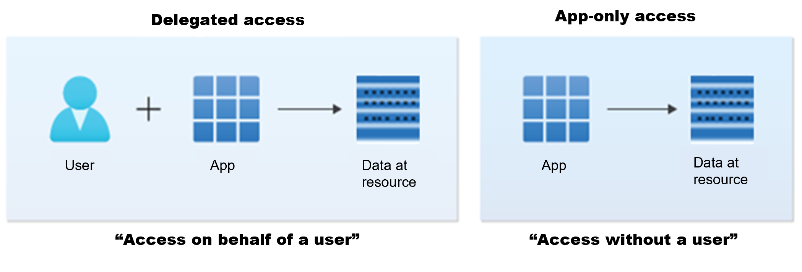

# Comience a utilizar el SDK de PowerShell de Microsoft Grap
En esta guía de inicio rápido, usará el SDK de PowerShell de Microsoft Graph para realizar algunas tareas básicas. Si aún no lo ha hecho, instálelo antes de seguir esta guía.

## Versión de API
El SDK contiene dos módulos, **Microsoft.Graph** y **Microsoft.Graph.Beta**, que invocan la API REST de Microsoft Graph v1.0 y la versión beta , respectivamente. Hay cmdlets disponibles para el módulo instalado.

Para comenzar a utilizar el SDK, siga estos pasos:
1. Instale el módulo **Microsoft.Graph** o **Microsoft.Graph.Beta**, según la versión de API que desee utilizar.
2. Importe el módulo a su sesión de PowerShell.
3. Autenticarse utilizando los permisos adecuados.
4. Comience a realizar llamadas a Microsoft Graph utilizando los cmdlets disponibles.

## Autenticación
El SDK de PowerShell admite dos tipos de autenticación: **delegated access** (acceso delegado) y **app-only access** (acceso exclusivo a la aplicación). En esta guía, usará el acceso delegado para iniciar sesión como usuario, dar su consentimiento a la aplicación para que actúe en su nombre y llamar a Microsoft Graph.

## Escenarios de acceso
Una aplicación puede acceder a los datos de dos maneras, como se ilustra en la siguiente imagen.

- **Acceso delegado**, una aplicación que actúa en nombre de un usuario que ha iniciado sesión.
- **Acceso exclusivo a la aplicación**, una aplicación que actúa con su propia identidad.

## Acceso delegado (acceso en nombre de un usuario)
En este escenario de acceso, un usuario inicia sesión en una aplicación cliente que llama a Microsoft Graph en su nombre. **Tanto la aplicación cliente como el usuario deben estar autorizados para realizar la solicitud**.

Para que la aplicación cliente esté autorizada a acceder a los datos en nombre del usuario que inició sesión, debe tener los permisos necesarios, que recibe mediante una combinación de dos factores:

- **Permisos delegados**, también conocidos como **ámbitos**: Permisos expuestos por Microsoft Graph que representan las operaciones que la aplicación puede realizar en nombre del usuario que ha iniciado sesión. <mark style="background-color: yellow;">La aplicación puede realizar una operación en nombre del usuario que ha iniciado sesión, pero no de otro</mark>.
- **Permisos de usuario**: Los permisos que el usuario que inició sesión tiene sobre el recurso. El usuario puede ser el propietario del recurso, compartirlo con él o tener permisos asignados mediante un sistema de control de acceso basado en roles (RBAC), como **Microsoft Entra RBAC**.

## Acceso solo a la aplicación (acceso sin usuario)
En este escenario de acceso, la aplicación puede interactuar con los datos por sí sola, sin necesidad de que el usuario haya iniciado sesión. El acceso exclusivo a la aplicación se utiliza en escenarios como la automatización y las copias de seguridad, y se utiliza principalmente en aplicaciones que se ejecutan como servicios en segundo plano o daemons. **Es adecuado cuando no se desea que un usuario inicie sesión o cuando los datos necesarios no se pueden asignar a un solo usuario**.

Para que una aplicación cliente esté autorizada a acceder a los datos con su propia identidad, debe tener los permisos necesarios, que recibe a través de una de las siguientes maneras:

- A la aplicación se le asignan **permisos de aplicación** compatibles con Microsoft Graph , también llamados **roles de aplicación**.
- A la aplicación se le asigna la propiedad del recurso que pretende administrar

## Referencias: 

- [Conceptos básicos de autenticación y autorización](https://learn.microsoft.com/en-us/graph/auth/auth-concepts#delegated-access-access-on-behalf-of-a-user)

