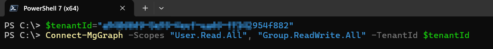
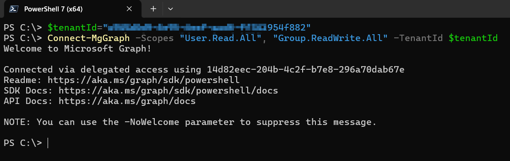

# Connect-MgGraph

Microsoft Graph PowerShell admite dos tipos de autenticación: acceso delegado y acceso exclusivo a la aplicación. Existen varios cmdlets que permiten administrar los diferentes parámetros necesarios durante la autenticación, como el entorno (environment), el ID de la aplicación (application ID) y el certificado (certificate).

```powershell
Connect-MgGraph
    [[-Scopes] <string[]>]
    [[-TenantId] <string>]
    [-ClientId <string>]
    [-ContextScope <ContextScope>]
    [-Environment <string>]
    [-UseDeviceCode]
    [-ClientTimeout <double>]
    [-NoWelcome]
    [-Break]
    [<CommonParameters>]
```
## Acceso delegado (Ejemplos)

### Autenticación interactiva

Usted proporciona los alcances que necesita durante su sesión

Este ejemplo muestra cómo autenticarse en MgGraph con alcances.

```powershell
Connect-MgGraph -Scopes "User.Read.All", "Group.ReadWrite.All"
```
Si tiene acceso a varios Tenant, podría indicar el id del tenant.
```powershell
Connect-MgGraph -Scopes "User.Read.All", "Group.ReadWrite.All" --TenantId $tenantId"
```
### Uso del flujo de código del dispositivo

Este ejemplo muestra cómo autenticarse en MgGraph con alcances y dispositivos.

```powershell
Connect-MgGraph -Scopes "User.Read.All", "Group.ReadWrite.All" -UseDeviceAuthentication
```

### Uso de su propio token de acceso

Este ejemplo muestra cómo autenticarse en un gráfico usando un token de acceso.

```powershell
Connect-MgGraph -Scopes "User.Read.All", "Group.ReadWrite.All" -AccessToken $AccessToken
```

### Aplicación personalizada

Este ejemplo muestra cómo autenticarse en un gráfico usando un token de acceso.

```powershell
Connect-MgGraph -ClientId $clientId -TenantId $tenantId
```

## Acceso solo a la aplicación (Ejemplos)

### Uso de credenciales de cliente con un certificado

Este ejemplo muestra cómo autenticarse en un gráfico usando un token de acceso.

```powershell
Connect-MgGraph -ClientId $clientId -TenantId $tenantId -CertificateThumbprint "YOUR_CERT_THUMBPRINT"
```

### Uso de credenciales de cliente con un certificado

```powershell
Connect-MgGraph -ClientId $clientId -TenantId $tenantId -CertificateName "YOUR_CERT_SUBJECT"
```

### Uso de credenciales de cliente con un certificado

```powershell
$Cert = Get-ChildItem Cert:\LocalMachine\My$CertThumbprint
Connect-MgGraph -ClientId $clientId -TenantId $tenantId  -Certificate $Cert"
```

## Uso de credenciales secretas del cliente

```powershell
$ClientSecretCredential = Get-Credential -Credential "Client_Id"
Connect-MgGraph -Identity
```

## Uso de identidad administrada

```powershell
Connect-MgGraph -Identity -ClientId "User_Assigned_Managed_identity_Client_Id"
```

#### Ejemplo práctico

El siguiente script establece una conexión autenticada al **SDK de Microsoft Graph para PowerShell** especificando el **Tenant ID** (identificador del inquilino de Azure AD) y los **permisos (scopes)** requeridos.


1. Ejecute en PowerShell

```powershell
$tenantId="//Aquí va tu tenantId//"
Connect-MgGraph -Scopes "User.Read.All", "Group.ReadWrite.All" --TenantId $tenantId"
```


2. Seleccione la cuenta para iniciar sesión.


3. Autorice los permisos solicitados.


4. Se mostrará el mensaje de Bienvenida.



## Referencias

- [Connect-MgGraph](https://learn.microsoft.com/en-us/powershell/module/microsoft.graph.authentication/connect-mggraph?view=graph-powershell-1.0)