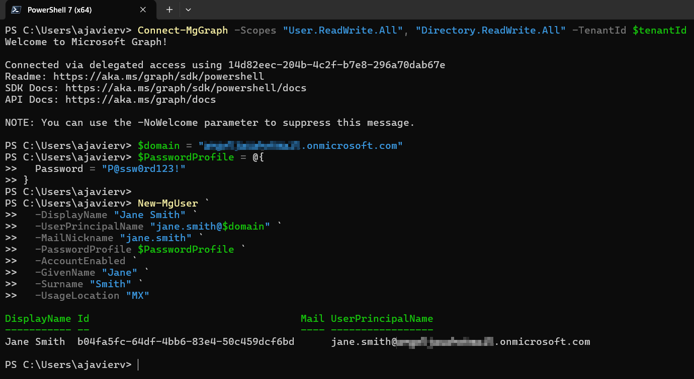
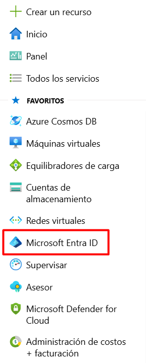
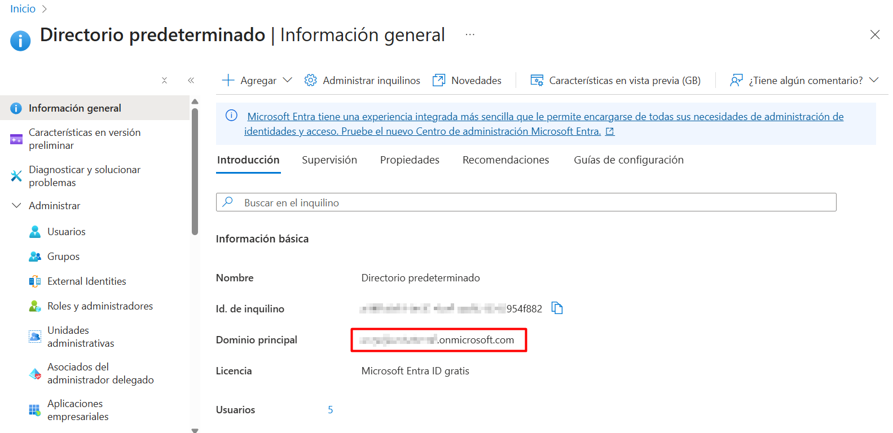

# New-MgUser

Crear un nuevo objeto de usuario.

```powershell
New-MgUser
    [-ResponseHeadersVariable <string>]
    [-AboutMe <string>]
    [-AccountEnabled]
    [-Activities <IMicrosoftGraphUserActivity[]>]
    [-AdditionalProperties <hashtable>]
    [-AgeGroup <string>]
    [-AgreementAcceptances <IMicrosoftGraphAgreementAcceptance[]>]
    [-AppRoleAssignments <IMicrosoftGraphAppRoleAssignment[]>]
    [-AssignedLicenses <IMicrosoftGraphAssignedLicense[]>]
    [-AssignedPlans <IMicrosoftGraphAssignedPlan[]>]
    [-Authentication <IMicrosoftGraphAuthentication>]
    [-AuthorizationInfo <IMicrosoftGraphAuthorizationInfo>]
    [-Birthday <datetime>]
    [-BusinessPhones <string[]>]
    [-Calendar <IMicrosoftGraphCalendar>]
    [-CalendarGroups <IMicrosoftGraphCalendarGroup[]>]
    [-CalendarView <IMicrosoftGraphEvent[]>]
    [-Calendars <IMicrosoftGraphCalendar[]>]
    [-Chats <IMicrosoftGraphChat[]>]
    [-City <string>]
    [-CloudClipboard <IMicrosoftGraphCloudClipboardRoot>]
    [-CompanyName <string>]
    [-ConsentProvidedForMinor <string>]
    [-ContactFolders <IMicrosoftGraphContactFolder[]>]
    [-Contacts <IMicrosoftGraphContact[]>]
    [-Country <string>]
    [-CreatedDateTime <datetime>]
    [-CreatedObjects <IMicrosoftGraphDirectoryObject[]>]
    [-CreationType <string>]
    [-CustomSecurityAttributes <hashtable>]
    [-DataSecurityAndGovernance <IMicrosoftGraphUserDataSecurityAndGovernance>]
    [-DeletedDateTime <datetime>]
    [-Department <string>]
    [-DeviceEnrollmentLimit <int>]
    [-DeviceManagementTroubleshootingEvents <IMicrosoftGraphDeviceManagementTroubleshootingEvent[]>]
    [-DirectReports <IMicrosoftGraphDirectoryObject[]>]
    [-DisplayName <string>]
    [-Drive <IMicrosoftGraphDrive>]
    [-Drives <IMicrosoftGraphDrive[]>]
    [-EmployeeExperience <IMicrosoftGraphEmployeeExperienceUser>]
    [-EmployeeHireDate <datetime>]
    [-EmployeeId <string>]
    [-EmployeeLeaveDateTime <datetime>]
    [-EmployeeOrgData <IMicrosoftGraphEmployeeOrgData>]
    [-EmployeeType <string>]
    [-Events <IMicrosoftGraphEvent[]>]
    [-Extensions <IMicrosoftGraphExtension[]>]
    [-ExternalUserState <string>]
    [-ExternalUserStateChangeDateTime <datetime>]
    [-FaxNumber <string>]
    [-FollowedSites <IMicrosoftGraphSite[]>]
    [-GivenName <string>]
    [-HireDate <datetime>]
    [-Id <string>]
    [-Identities <IMicrosoftGraphObjectIdentity[]>]
    [-ImAddresses <string[]>]
    [-InferenceClassification <IMicrosoftGraphInferenceClassification>]
    [-Insights <hashtable>]
    [-Interests <string[]>]
    [-IsManagementRestricted]
    [-IsResourceAccount]
    [-JobTitle <string>]
    [-JoinedTeams <IMicrosoftGraphTeam[]>]
    [-LastPasswordChangeDateTime <datetime>]
    [-LegalAgeGroupClassification <string>]
    [-LicenseAssignmentStates <IMicrosoftGraphLicenseAssignmentState[]>]
    [-LicenseDetails <IMicrosoftGraphLicenseDetails[]>]
    [-Mail <string>]
    [-MailFolders <IMicrosoftGraphMailFolder[]>]
    [-MailNickname <string>]
    [-MailboxSettings <IMicrosoftGraphMailboxSettings>]
    [-ManagedAppRegistrations <IMicrosoftGraphManagedAppRegistration[]>]
    [-ManagedDevices <IMicrosoftGraphManagedDevice[]>]
    [-Manager <IMicrosoftGraphDirectoryObject>]
    [-MemberOf <IMicrosoftGraphDirectoryObject[]>]
    [-Messages <IMicrosoftGraphMessage[]>]
    [-MobilePhone <string>]
    [-MySite <string>]
    [-Oauth2PermissionGrants <IMicrosoftGraphOAuth2PermissionGrant[]>]
    [-OfficeLocation <string>]
    [-OnPremisesDistinguishedName <string>]
    [-OnPremisesDomainName <string>]
    [-OnPremisesExtensionAttributes <IMicrosoftGraphOnPremisesExtensionAttributes>]
    [-OnPremisesImmutableId <string>]
    [-OnPremisesLastSyncDateTime <datetime>]
    [-OnPremisesProvisioningErrors <IMicrosoftGraphOnPremisesProvisioningError[]>]
    [-OnPremisesSamAccountName <string>]
    [-OnPremisesSecurityIdentifier <string>]
    [-OnPremisesSyncEnabled]
    [-OnPremisesUserPrincipalName <string>]
    [-Onenote <IMicrosoftGraphOnenote>]
    [-OnlineMeetings <IMicrosoftGraphOnlineMeeting[]>]
    [-OtherMails <string[]>]
    [-Outlook <IMicrosoftGraphOutlookUser>]
    [-OwnedDevices <IMicrosoftGraphDirectoryObject[]>]
    [-OwnedObjects <IMicrosoftGraphDirectoryObject[]>]
    [-PasswordPolicies <string>]
    [-PasswordProfile <IMicrosoftGraphPasswordProfile>]
    [-PastProjects <string[]>]
    [-People <IMicrosoftGraphPerson[]>]
    [-PermissionGrants <IMicrosoftGraphResourceSpecificPermissionGrant[]>]
    [-Photo <IMicrosoftGraphProfilePhoto>]
    [-Photos <IMicrosoftGraphProfilePhoto[]>]
    [-Planner <IMicrosoftGraphPlannerUser>]
    [-PostalCode <string>]
    [-PreferredDataLocation <string>]
    [-PreferredLanguage <string>]
    [-PreferredName <string>]
    [-Presence <IMicrosoftGraphPresence>]
    [-Print <IMicrosoftGraphUserPrint>]
    [-ProvisionedPlans <IMicrosoftGraphProvisionedPlan[]>]
    [-ProxyAddresses <string[]>]
    [-RegisteredDevices <IMicrosoftGraphDirectoryObject[]>]
    [-Responsibilities <string[]>]
    [-Schools <string[]>]
    [-ScopedRoleMemberOf <IMicrosoftGraphScopedRoleMembership[]>]
    [-SecurityIdentifier <string>]
    [-ServiceProvisioningErrors <IMicrosoftGraphServiceProvisioningError[]>]
    [-Settings <IMicrosoftGraphUserSettings>]
    [-ShowInAddressList]
    [-SignInActivity <IMicrosoftGraphSignInActivity>]
    [-SignInSessionsValidFromDateTime <datetime>]
    [-Skills <string[]>]
    [-Solutions <IMicrosoftGraphUserSolutionRoot>]
    [-Sponsors <IMicrosoftGraphDirectoryObject[]>]
    [-State <string>]
    [-StreetAddress <string>]
    [-Surname <string>]
    [-Teamwork <IMicrosoftGraphUserTeamwork>]
    [-Todo <IMicrosoftGraphTodo>]
    [-TransitiveMemberOf <IMicrosoftGraphDirectoryObject[]>]
    [-UsageLocation <string>]
    [-UserPrincipalName <string>]
    [-UserType <string>]
    [-Break]
    [-Headers <IDictionary>]
    [-HttpPipelineAppend <SendAsyncStep[]>]
    [-HttpPipelinePrepend <SendAsyncStep[]>]
    [-Proxy <uri>]
    [-ProxyCredential <pscredential>]
    [-ProxyUseDefaultCredentials]
    [-WhatIf]
    [-Confirm]
    [<CommonParameters>]
```
## Permisos

|Permission type|Permissions (from least to most privileged)|
----------------|-------------------------------------------|
|Delegated (work or school account)|User.ReadWrite.All, Directory.ReadWrite.All, DeviceManagementServiceConfig.ReadWrite.All, DeviceManagementManagedDevices.ReadWrite.All, DeviceManagementConfiguration.ReadWrite.All, DeviceManagementApps.ReadWrite.All,|
|Delegated (personal Microsoft account)|Not supported|
|Application|User.ReadWrite.All, Directory.ReadWrite.All, DeviceManagementServiceConfig.ReadWrite.All, DeviceManagementManagedDevices.ReadWrite.All, DeviceManagementConfiguration.ReadWrite.All, DeviceManagementApps.ReadWrite.All,|

## Ejemplo
Este comando primero establece un valor para la variable de perfil de contraseña y lo utiliza para crear un nuevo usuario.

```powershell
$PasswordProfile = @{
  Password = 'xWwvJ]6NMw+bWH-d'
  }
New-MgUser -DisplayName 'Rene Magi' -PasswordProfile $PasswordProfile -AccountEnabled -MailNickName 'ReneMagi' -UserPrincipalName 'ReneMagi@contoso.com'
```

Id                                   DisplayName Mail UserPrincipalName                    UserType
--                                   ----------- ---- -----------------                    --------
1fe21dc8-7d53-4a92-b1fa-32043b9875a7 Rene Magi        ReneMagi@contoso.com

## Ejemplo práctico

```powershell
$tenantId="//Aquí va tu tenantId"
Connect-MgGraph -Scopes "User.ReadWrite.All", "Directory.ReadWrite.All" -TenantId $tenantId
$domain = "//Aquí va tu dominio"
$PasswordProfile = @{
  Password = "P@ssw0rd123!"
}

New-MgUser `
  -DisplayName "Jane Smith" `
  -UserPrincipalName "jane.smith@$domain" `
  -MailNickname "jane.smith" `
  -PasswordProfile $PasswordProfile `
  -AccountEnabled `
  -GivenName "Jane" `
  -Surname "Smith" `
  -UsageLocation "MX"

```



## Nombre de dominio

Para obtener su nombre de dominio, siga los siguientes pasos.
1. Inicie sesión en el Portal de Azure con su cuenta.
2. Seleccione **Microsoft Entra ID** en el panel izquierdo.


3. En **Información general**, busque su dominio en **Dominio principal**


## Referencias
[New-MgUser](https://learn.microsoft.com/en-us/powershell/module/microsoft.graph.users/new-mguser?view=graph-powershell-1.0)