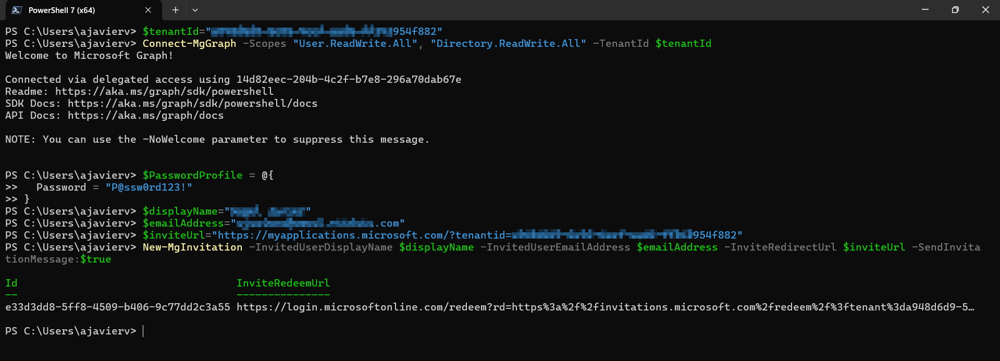
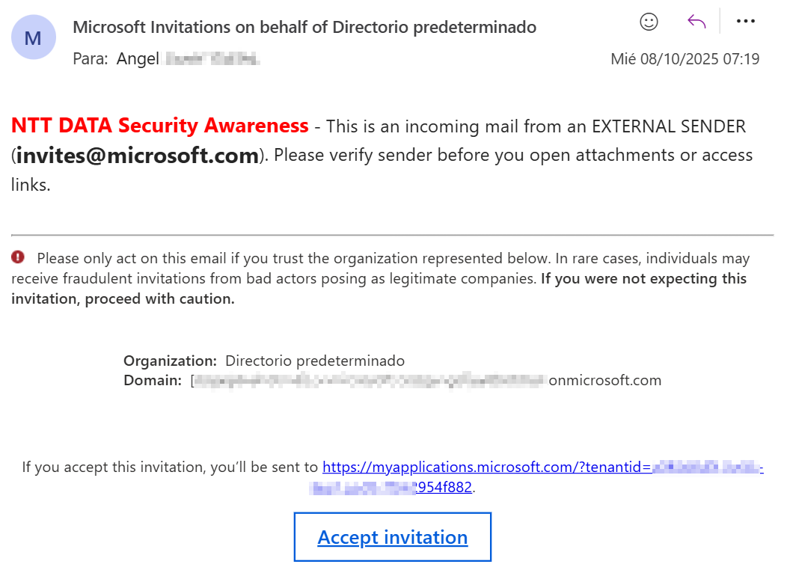

# New-MgInvitation

Utilice esta API para crear una nueva invitación o restablecer el estado de canje de un usuario invitado que ya la haya canjeado. La invitación agrega al usuario externo a la organización como parte de la colaboración B2B. La colaboración B2B es compatible con Microsoft Entra External ID en Workforce y en inquilinos externos.

```powershell
New-MgInvitation
    [-ResponseHeadersVariable <string>]
    [-AdditionalProperties <hashtable>]
    [-Id <string>]
    [-InviteRedeemUrl <string>]
    [-InviteRedirectUrl <string>]
    [-InvitedUser <IMicrosoftGraphUser>]
    [-InvitedUserDisplayName <string>]
    [-InvitedUserEmailAddress <string>]
    [-InvitedUserMessageInfo <IMicrosoftGraphInvitedUserMessageInfo>]
    [-InvitedUserSponsors <IMicrosoftGraphDirectoryObject[]>]
    [-InvitedUserType <string>]
    [-ResetRedemption]
    [-SendInvitationMessage]
    [-Status <string>]
    [-Break]
    [-Headers <IDictionary>]
    [-HttpPipelineAppend <SendAsyncStep[]>]
    [-HttpPipelinePrepend <SendAsyncStep[]>]
    [-Proxy <uri>]
    [-ProxyCredential <pscredential>]
    [-ProxyUseDefaultCredentials]
    [-WhatIf]
    [-Confirm]
    [<CommonParameters>]
```

## Permisos
|Permission type	|Permissions (from least to most privileged)|
|---|---|
|Delegated (work or school account)	|User.Invite.All, User.ReadWrite.All, Directory.ReadWrite.All,|
|Delegated (personal Microsoft account)	|Not supported|
|Application	|User.Invite.All, User.ReadWrite.All, Directory.ReadWrite.All,|

## Ejemplos

Invitar a un usuario y enviar un correo electrónico de invitación predeterminado

```powershell
$tenantId="//Aquí va tu tenantId"
Connect-MgGraph -Scopes "User.ReadWrite.All", "Directory.ReadWrite.All" -TenantId $tenantId
$domain = "//Aquí va tu dominio"
$PasswordProfile = @{
  Password = "P@ssw0rd123!"
}
$displayName="//Aquí va el nombre de tu usuario invitado"
$emailAddress="//Aquí va el correo electrónico de tu usuario invitado"
$inviteUrl="https://myapplications.microsoft.com/?tenantid=a948d6d9-5e95-4eef-aad6-ff342954f882"
New-MgInvitation -InvitedUserDisplayName $displayName -InvitedUserEmailAddress $emailAddress -InviteRedirectUrl $inviteUrl -SendInvitationMessage:$true
```

## Ejemplo práctico
1. Ejecute los siguientes comandos.

```powershell
$tenantId="//Aquí va tu tenantId"
Connect-MgGraph -Scopes "User.ReadWrite.All", "Directory.ReadWrite.All" -TenantId $tenantId
$PasswordProfile = @{
  Password = "P@ssw0rd123!"
}
$displayName="//Nombre de tu usuario"
$emailAddress="//Correo de tu usuario invitado"
$inviteUrl="https://myapplications.microsoft.com/?tenantid=//Aquí va tu tenantId"
New-MgInvitation -InvitedUserDisplayName $displayName -InvitedUserEmailAddress $emailAddress -InviteRedirectUrl $inviteUrl -SendInvitationMessage:$true

```



2. El usuario recibirá una invitación por correo.

