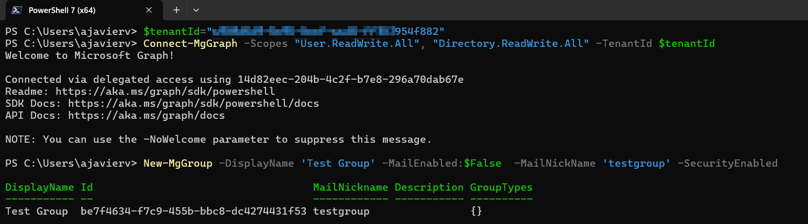
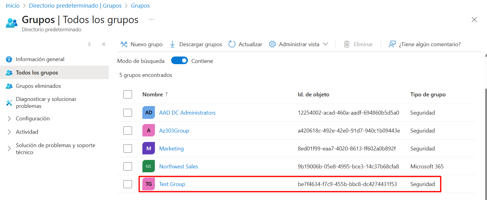
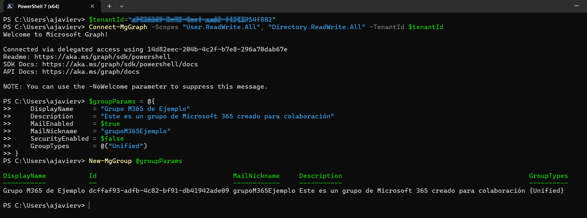
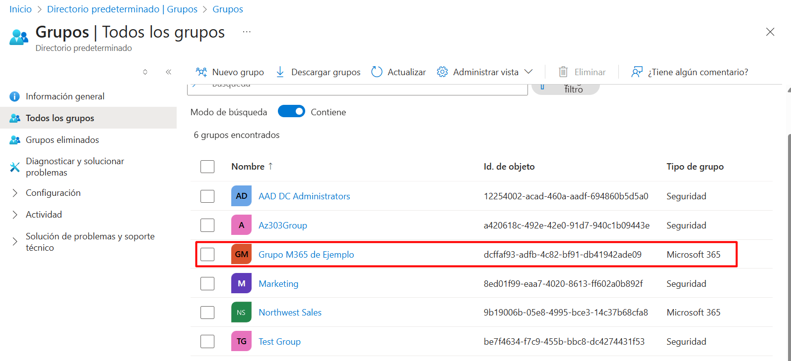

# New-MgGroup

Crea un nuevo objeto de grupo si no existe o actualiza las propiedades de uno existente. Puede crear o actualizar los siguientes tipos de grupo: De forma predeterminada, esta operación devuelve solo un subconjunto de las propiedades de cada grupo.

```powershell
New-MgGroup
    [-ResponseHeadersVariable <string>]
    [-AcceptedSenders <IMicrosoftGraphDirectoryObject[]>]
    [-AdditionalProperties <hashtable>]
    [-AllowExternalSenders]
    [-AppRoleAssignments <IMicrosoftGraphAppRoleAssignment[]>]
    [-AssignedLabels <IMicrosoftGraphAssignedLabel[]>]
    [-AssignedLicenses <IMicrosoftGraphAssignedLicense[]>]
    [-AutoSubscribeNewMembers]
    [-Calendar <IMicrosoftGraphCalendar>]
    [-CalendarView <IMicrosoftGraphEvent[]>]
    [-Classification <string>]
    [-Conversations <IMicrosoftGraphConversation[]>]
    [-CreatedDateTime <datetime>]
    [-CreatedOnBehalfOf <IMicrosoftGraphDirectoryObject>]
    [-DeletedDateTime <datetime>]
    [-Description <string>]
    [-DisplayName <string>]
    [-Drive <IMicrosoftGraphDrive>]
    [-Drives <IMicrosoftGraphDrive[]>]
    [-Events <IMicrosoftGraphEvent[]>]
    [-ExpirationDateTime <datetime>]
    [-Extensions <IMicrosoftGraphExtension[]>]
    [-GroupLifecyclePolicies <IMicrosoftGraphGroupLifecyclePolicy[]>]
    [-GroupTypes <string[]>]
    [-HasMembersWithLicenseErrors]
    [-HideFromAddressLists]
    [-HideFromOutlookClients]
    [-Id <string>]
    [-IsArchived]
    [-IsAssignableToRole]
    [-IsManagementRestricted]
    [-IsSubscribedByMail]
    [-LicenseProcessingState <IMicrosoftGraphLicenseProcessingState>]
    [-Mail <string>]
    [-MailEnabled]
    [-MailNickname <string>]
    [-MemberOf <IMicrosoftGraphDirectoryObject[]>]
    [-Members <IMicrosoftGraphDirectoryObject[]>]
    [-MembersWithLicenseErrors <IMicrosoftGraphDirectoryObject[]>]
    [-MembershipRule <string>]
    [-MembershipRuleProcessingState <string>]
    [-OnPremisesDomainName <string>]
    [-OnPremisesLastSyncDateTime <datetime>]
    [-OnPremisesNetBiosName <string>]
    [-OnPremisesProvisioningErrors <IMicrosoftGraphOnPremisesProvisioningError[]>]
    [-OnPremisesSamAccountName <string>]
    [-OnPremisesSecurityIdentifier <string>]
    [-OnPremisesSyncEnabled]
    [-Onenote <IMicrosoftGraphOnenote>]
    [-Owners <IMicrosoftGraphDirectoryObject[]>]
    [-PermissionGrants <IMicrosoftGraphResourceSpecificPermissionGrant[]>]
    [-Photo <IMicrosoftGraphProfilePhoto>]
    [-Photos <IMicrosoftGraphProfilePhoto[]>]
    [-Planner <IMicrosoftGraphPlannerGroup>]
    [-PreferredDataLocation <string>]
    [-PreferredLanguage <string>]
    [-ProxyAddresses <string[]>]
    [-RejectedSenders <IMicrosoftGraphDirectoryObject[]>]
    [-RenewedDateTime <datetime>]
    [-SecurityEnabled]
    [-SecurityIdentifier <string>]
    [-ServiceProvisioningErrors <IMicrosoftGraphServiceProvisioningError[]>]
    [-Settings <IMicrosoftGraphGroupSetting[]>]
    [-Sites <IMicrosoftGraphSite[]>]
    [-Team <IMicrosoftGraphTeam>]
    [-Theme <string>]
    [-Threads <IMicrosoftGraphConversationThread[]>]
    [-TransitiveMemberOf <IMicrosoftGraphDirectoryObject[]>]
    [-TransitiveMembers <IMicrosoftGraphDirectoryObject[]>]
    [-UniqueName <string>]
    [-UnseenCount <int>]
    [-Visibility <string>]
    [-Break]
    [-Headers <IDictionary>]
    [-HttpPipelineAppend <SendAsyncStep[]>]
    [-HttpPipelinePrepend <SendAsyncStep[]>]
    [-Proxy <uri>]
    [-ProxyCredential <pscredential>]
    [-ProxyUseDefaultCredentials]
    [-WhatIf]
    [-Confirm]
    [<CommonParameters>]
```

## Permisos
|Permission type|Permissions (from least to most privileged)|
|---|---|
|Delegated (work or school account)|Group.ReadWrite.All, Directory.ReadWrite.All,|
|Delegated (personal Microsoft account)|Not supported|
|Application|Group.Create, Group.ReadWrite.All, Directory.ReadWrite.All,|

## Ejemplos

Este ejemplo crea un nuevo grupo.

```powershell
New-MgGroup -DisplayName 'Test Group' -MailEnabled:$False  -MailNickName 'testgroup' -SecurityEnabled

Id                                   DisplayName Description GroupTypes
--                                   ----------- ----------- ----------
15bb6c2c-ac32-41a1-b9ec-b6300b8b8e52 Test Group              {}
```

## Ejemplo práctico (Crear grupo de seguridad)

1. Ejecute los siguientes comandos.

```powershell
$tenantId="//Aquí va tu tenantId"
Connect-MgGraph -Scopes "User.ReadWrite.All", "Directory.ReadWrite.All" -TenantId $tenantId
New-MgGroup -DisplayName 'Test Group' -MailEnabled:$False  -MailNickName 'testgroup' -SecurityEnabled
```



2. Verifique que el grupo se creó en el portal de Azure.




## Ejemplo práctico (Crear grupo Microsoft 635)

1. Ejecute los siguientes comandos.

```powershell
$tenantId="//Aquí va tu tenantId"
Connect-MgGraph -Scopes "User.ReadWrite.All", "Directory.ReadWrite.All" -TenantId $tenantId
$groupParams = @{
    DisplayName     = "Grupo M365 de Ejemplo"
    Description     = "Este es un grupo de Microsoft 365 creado para colaboración"
    MailEnabled     = $true
    MailNickname    = "grupoM365Ejemplo"
    SecurityEnabled = $false
    GroupTypes      = @("Unified")
}
New-MgGroup @groupParams
```


2. Verifique que el grupo se creó en el portal de Azure.



## Referencias
- [New-MgGroup](https://learn.microsoft.com/en-us/powershell/module/microsoft.graph.groups/new-mggroup?view=graph-powershell-1.0)