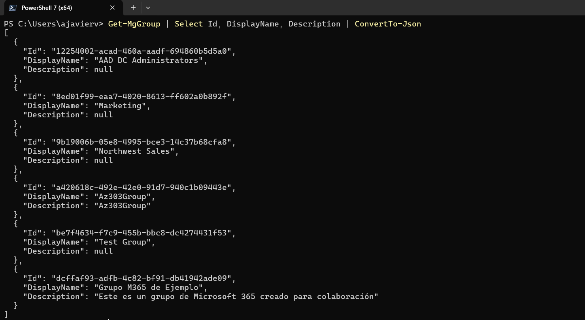

# Get-MgGroup

Obtener las propiedades y relaciones de un objeto de grupo. Esta operación devuelve, por defecto, solo un subconjunto de todas las propiedades disponibles, como se indica en la sección "Propiedades". Para obtener propiedades que no se devuelven por defecto, especifíquelas en una opción de consulta OData `$select`. Las propiedades `hasMembersWithLicenseErrors` e `isArchived` son una excepción y no se devuelven en la consulta `$select`.

```powershell
Get-MgGroup
    [-ExpandProperty <string[]>]
    [-Property <string[]>]
    [-Filter <string>]
    [-Search <string>]
    [-Skip <int>]
    [-Sort <string[]>]
    [-Top <int>]
    [-ConsistencyLevel <string>]
    [-ResponseHeadersVariable <string>]
    [-Break]
    [-Headers <IDictionary>]
    [-HttpPipelineAppend <SendAsyncStep[]>]
    [-HttpPipelinePrepend <SendAsyncStep[]>]
    [-Proxy <uri>]
    [-ProxyCredential <pscredential>]
    [-ProxyUseDefaultCredentials]
    [-PageSize <int>]
    [-All]
    [-CountVariable <string>]
    [<CommonParameters>]
```

## Permisos
|Permission type|Permissions (from least to most privileged)|
|---|---|
|Delegated (work or school account)	|GroupMember.Read.All, Group.ReadWrite.All, Group.Read.All, Directory.ReadWrite.All, Directory.Read.All,|
|Delegated (personal Microsoft account)	|Not supported|
|Application|GroupMember.Read.All, Group.ReadWrite.All, Group.Read.All, Directory.ReadWrite.All, Directory.Read.All,|

## Ejemplos

Obtener una lista de grupos
```powershell
Connect-MgGraph -Scopes 'Group.Read.All'
Get-MgGroup |
  Format-List Id, DisplayName, Description, GroupTypes

Id          : 0a1c8435-40a3-4a72-8586-e916c12b613a
DisplayName : Marketing
Description : A group to synthesize, analyze, and synchronize our marketing efforts.
GroupTypes  : {Unified}

Id          : a8fbb1b5-b994-4835-9183-c7421d149132
DisplayName : Business Development
Description : Welcome to the BizDev team.
GroupTypes  : {Unified}
```

## Ejemplos prácticos.

1. Obtener información de grupos con salida predeterminada

```powershell
$tenantId="//Aquí va tu tenantId"
Connect-MgGraph -Scopes "User.ReadWrite.All", "Directory.ReadWrite.All" -TenantId $tenantId
Get-MgGroup
```


2. Obtener información de grupos con propiedades especificas
```powershell
Get-MgGroup | Select Id, DisplayName, Descriptioncolaboración
```


3. Obtener información de grupos con propiedades especificas, convirtiendo la salida en Json
```powershell
Get-MgGroup | Select Id, DisplayName, Descriptioncolaboración | ConverTo-Json
```




4. Obtener información de grupos con propiedades especificas, convirtiendo la salida en Yaml
```powershell
Get-MgGroup | Select Id, DisplayName, Descriptioncolaboración | ConverTo-Yaml
```


<mark style="background-color: yellow;">Para convertir la salida en formato yaml debe instalar el modulo correspondiente</mark>
```powershell
Import-Module powershell-yaml
```

5. Obtener información por GroupId convirtiendo la salida en Json
```powershell
Get-MgGroup -GroupId dcffaf93-adfb-4c82-bf91-db41942ade09 | Select Id, DisplayName, Description | ConvertTo-Json
```


## Referencias
- [Get-MgGroup](https://learn.microsoft.com/en-us/powershell/module/microsoft.graph.groups/get-mggroup?view=graph-powershell-1.0)