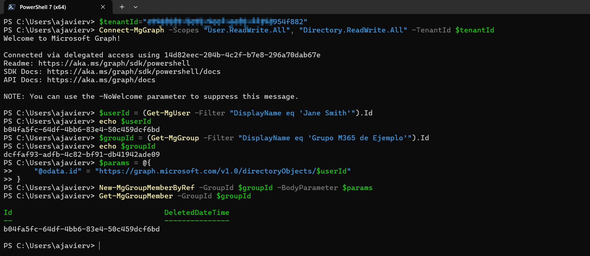
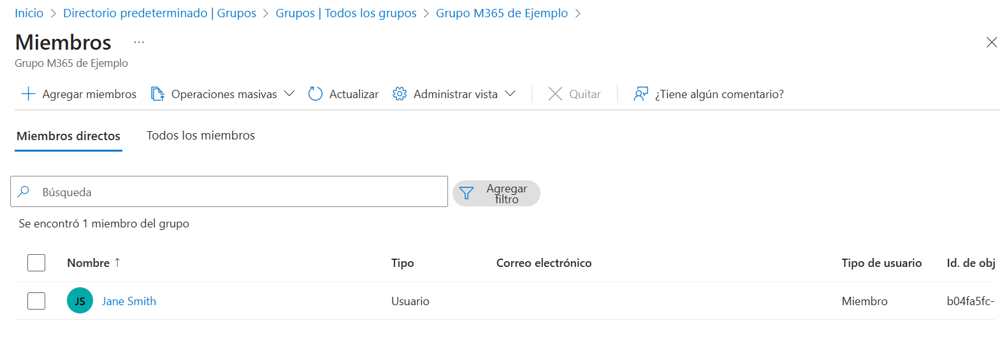

# New-MgGroupMemberByRef

Permite agregar un miembro a un grupo de seguridad o de Microsoft 365. Al usar la API para agregar varios miembros en una sola solicitud, puede agregar hasta 20. La siguiente tabla muestra los tipos de miembros que se pueden agregar a grupos de seguridad o de Microsoft 365.

```powershell
New-MgGroupMemberByRef
    -GroupId <string>
    -OdataId <string>
    [-ResponseHeadersVariable <string>]
    [-AdditionalProperties <hashtable>]
    [-Break]
    [-Headers <IDictionary>]
    [-HttpPipelineAppend <SendAsyncStep[]>]
    [-HttpPipelinePrepend <SendAsyncStep[]>]
    [-PassThru]
    [-Proxy <uri>]
    [-ProxyCredential <pscredential>]
    [-ProxyUseDefaultCredentials]
    [-WhatIf]
    [-Confirm]
    [<CommonParameters>]
```

## Permisos

No especificados.

## Ejemplo

```powershell
Import-Module Microsoft.Graph.Groups

$params = @{
	"@odata.id" = "https://graph.microsoft.com/v1.0/directoryObjects/{id}"
}

New-MgGroupMemberByRef -GroupId $groupId -BodyParameter $params
```

## Ejemplos prácticos

### Agregar un usuario a un grupo Microsoft 365
1. Ejecute los siguientes comandos.
 ```powershell
$tenantId="//Aquí va tu tenantId"
Connect-MgGraph -Scopes "User.ReadWrite.All", "Directory.ReadWrite.All" -TenantId $tenantId
$userId = (Get-MgUser -Filter "DisplayName eq 'Jane Smith'").Id
echo $userId 
$groupId = (Get-MgGroup -Filter "DisplayName eq 'Grupo M365 de Ejemplo'").Id
echo $groupId 
$params = @{
    "@odata.id" = "https://graph.microsoft.com/v1.0/directoryObjects/$userId"
}
New-MgGroupMemberByRef -GroupId $groupId -BodyParameter $params
Get-MgGroupMember -GroupId $groupId
 ```
En el ejemplo anterior, se busca un usuario que se llama "Jane Smith" y se agrega al grupo "Grupo M365 de Ejemplo"



2. En el portal de Azure, en Microsoft Entra ID, verifique que el usuario fue agregado de manera correcta.




### Agregar un usuario a un grupo Microsoft 365

## Referencias
- [New-MgGroupMemberByRef](https://learn.microsoft.com/en-us/powershell/module/microsoft.graph.groups/new-mggroupmemberbyref?view=graph-powershell-1.0)